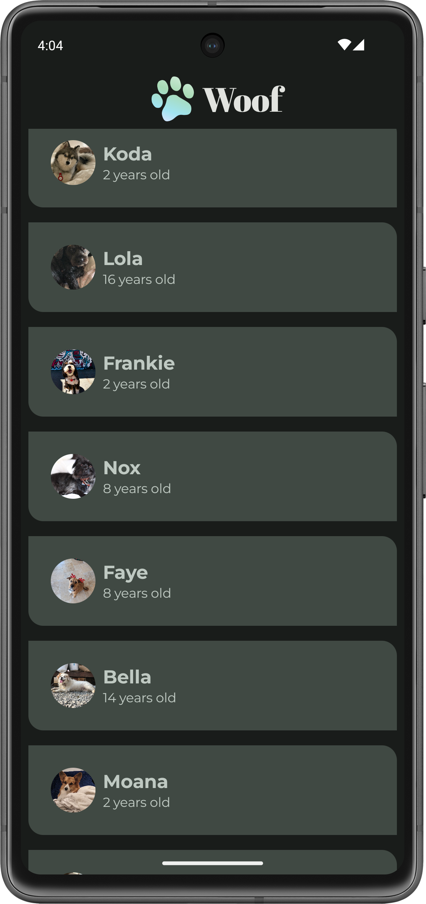
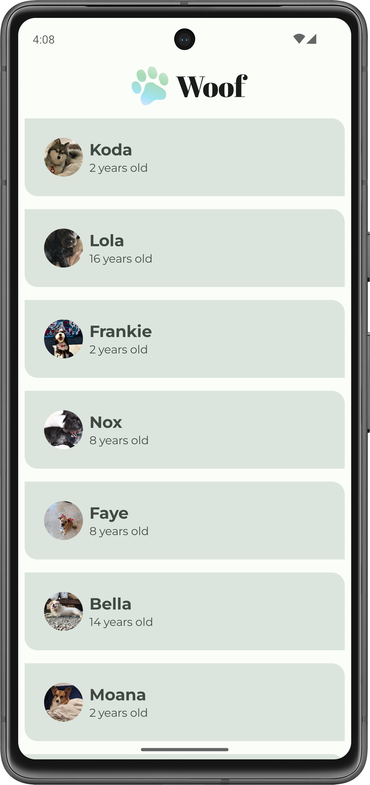

# WoofApp

WoofApp is an Android application built using Jetpack Compose. The app is designed to showcase different dog breeds, with images and details for each breed in an engaging UI layout. This project was developed as part of learning Android development with Jetpack Compose.

## Project Overview

The **WoofApp** provides users with a scrollable list of various dog breeds, each displayed in a card format. It focuses on implementing modern UI principles with Jetpack Compose, creating a responsive and interactive app.

## Features

- **Dog Breed List**: Displays a scrollable list of dog breeds with names and images.
- **Composable UI**: Built entirely with Jetpack Compose, making the UI modular and reusable.
- **Card Layout**: Each dog breed is represented in a card format using the `Card` composable, with embedded images and text.
- **LazyColumn**: Uses `LazyColumn` for efficient rendering of long lists.
- **Material Theming**: Utilizes Material Design principles for a polished and consistent user interface.

## What I Learned

From building this app, I gained valuable experience in creating a **Material app**. Here are the key things I learned:

- **Custom Color Palette**: I created a custom color palette for both light and dark themes, ensuring that the app adapts beautifully to different system preferences.
- **Custom Shapes**: Defined custom shapes for different UI components, enhancing the visual appeal of the app.
- **Custom Fonts**: Downloaded and added new fonts to the app, enriching the typography with a distinctive look and feel.
- **Top Bar**: Designed and implemented a beautiful top bar that ties the app's design together seamlessly.

These skills helped me better understand **Material Theming**, which enables you to use Material Design in your app while customizing colors, typography, and shapes to match your brand and design preferences.

## Material Theming Summary

- **Material Theming** allows you to use Material Design in your app with guidance on customizing colors, typography, and shapes.
- The `Theme.kt` file is where the theme is defined through a composable named `WoofTheme()`. Within this function, the `MaterialTheme` object sets the color, typography, shapes, and content of the app.
- `Color.kt` lists the colors used in the app. In `Theme.kt`, I assigned these colors in `LightColorPalette` and `DarkColorPalette` to specific slots. Not all slots need to be assigned.
- Your app can opt-in to **Force Dark**, meaning the system will implement a dark theme. However, it provides a better experience if you define your own dark theme.
- `Shape.kt` is where I defined the app's shapes, which help direct attention, identify components, communicate state, and express the app’s brand.
- `Type.kt` is where I initialized custom fonts, assigning `fontFamily`, `fontWeight`, and `fontSize` for the Material Design type scale. The type scale includes 15 contrasting styles that support the needs of your app and its content.

## Technologies Used

- **Jetpack Compose**: For building the UI with modern declarative patterns.
- **Kotlin**: The programming language used to develop the app.
- **Material Design**: Ensures the app has a clean and user-friendly interface.
- **LazyColumn**: For efficient and performance-optimized scrolling of list items.

## Screenshots
<div align="center">

<!-- Dark Mode -->

<p style="text-align:center;"> When Dark Mode is ON . </em></p>

<!-- Light Mode -->

<p style="text-align:center;"><em>When Dark Mode is OFF</em></p>


</div>


## Getting Started

### Prerequisites

- Android Studio Arctic Fox or later with Compose support.
- Basic knowledge of Android development and Jetpack Compose.

### Installation

1. Clone the repository:

   ```bash
   git clone https://github.com/AdityaPSingh-dev/WoofApp.git
   
2. Open the project in Android Studio.

3. Build and run the app on an Android device or emulator.

### How to Use
- Launch the app to see a list of different dog breeds.
- Scroll through the list to view the breeds, their names, and corresponding image
### License and Copyright
This project is licensed under the Apache 2.0 License. See the LICENSE file for more details.
The original project is forked from [Google's Android Developer Training Repo](https://github.com/google-developer-training/basic-android-kotlin-compose-training-woof/tree/starter?tab=License-1-ov-file). Copyright for the original content belongs to Google and other contributors as noted in their repository.

